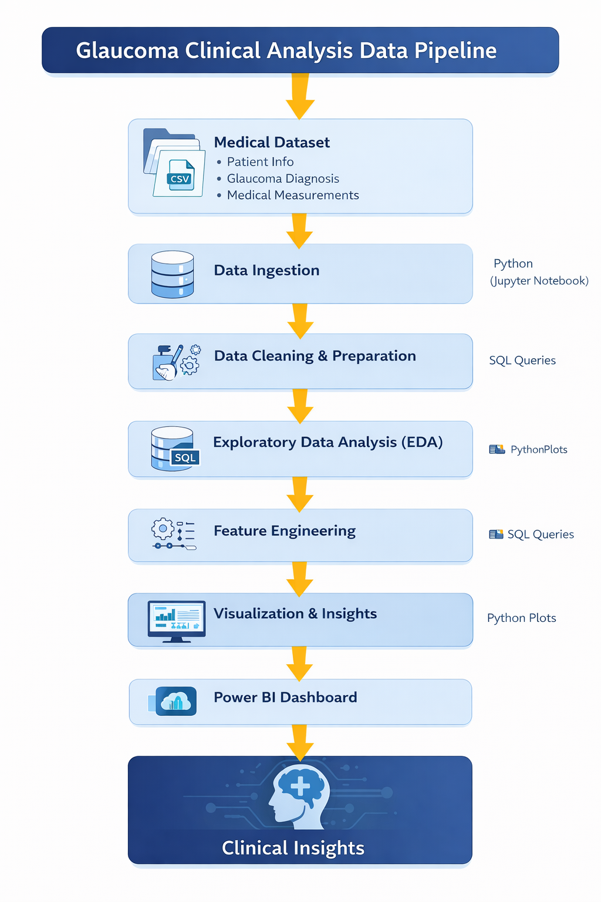
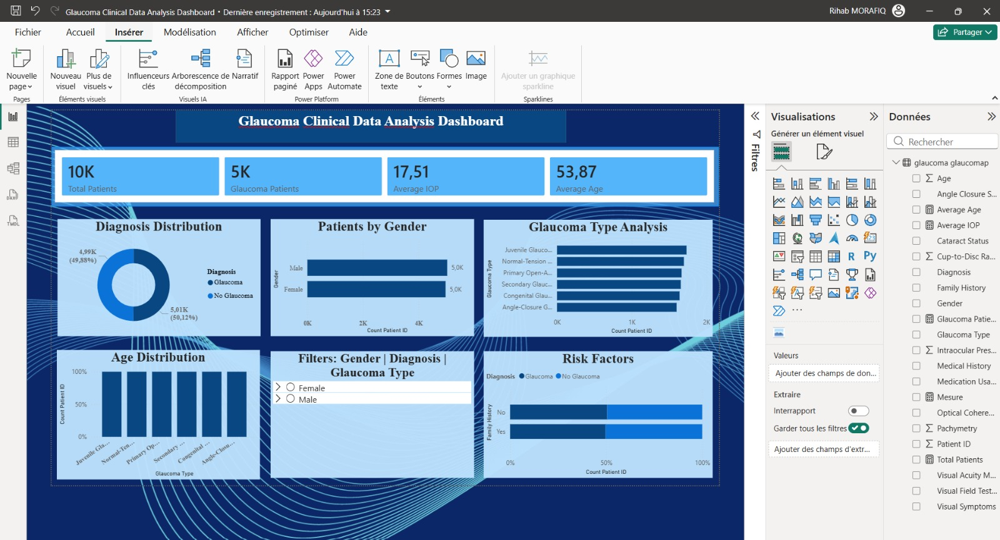

# Glaucoma Medical Data Analysis

## Overview
This project analyzes glaucoma medical data to identify patterns in diagnosis, risk factors, and patient characteristics.

## Data Pipeline

## Technologies
- Python
- Pandas
- Matplotlib
- SQL
- Power BI

## Data Analysis
The project includes:

- Data cleaning and preparation
- Exploratory Data Analysis (EDA)
- Medical risk factor analysis
- Patient demographic insights

## Dashboard

The Power BI dashboard provides insights on:

- Glaucoma diagnosis distribution
- Patient demographics
- Risk factors
- Glaucoma types

## Project Structure

data/ – medical datasets  
notebooks/ – Jupyter analysis  
sql/ – SQL queries  
powerbi/ – interactive dashboard  

## Dashboard Preview

## Author
Data analysis project for healthcare analytics.
